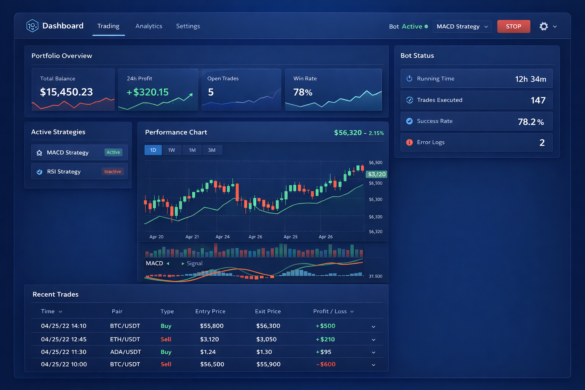
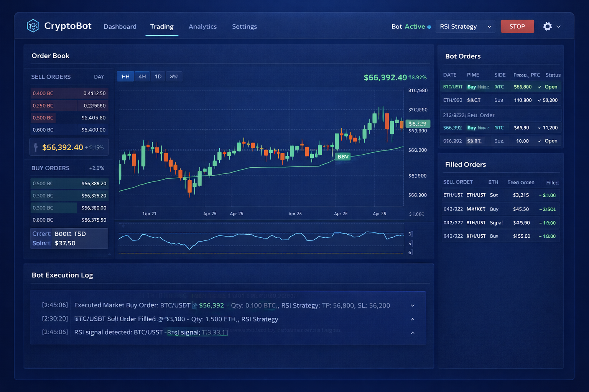
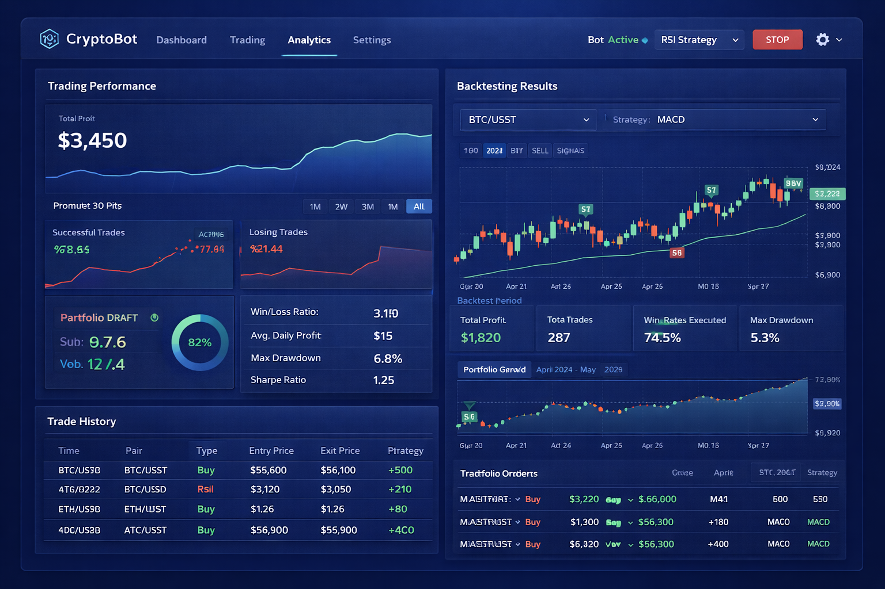

# 🤖 CryptoBot Showcase

This document presents the visual interface and workflow of **CryptoBot**.

---

## 🖥️ Application Overview

CryptoBot is a Windows-based executable application for automated cryptocurrency trading.

* No installation complexity
* Fast execution
* Real-time monitoring
* Designed for practical trading usage

---

## 📊 Dashboard

The dashboard gives a quick overview of system status and trading performance.

**Includes:**

* Balance overview
* Active trades
* Strategy status
* Performance charts

---

## 💹 Trading Panel

The trading panel is used to monitor and execute trades in real time.

**Includes:**

* Live orders
* Entry and exit signals
* Market data feed
* Execution logs

---

## 📈 Analytics

Analytics provide insight into trading performance and strategy effectiveness.

**Includes:**

* Profit / Loss charts
* Trade history
* Backtesting results
* Performance metrics

---

## ⚙️ Configuration

CryptoBot supports flexible configuration:

* Strategy selection
* Risk parameters
* Exchange setup
* Trading behavior tuning

---

## 🚀 Workflow

1. Launch `CryptoBot.exe`
2. Configure API keys
3. Select a strategy
4. Adjust risk settings
5. Start trading
